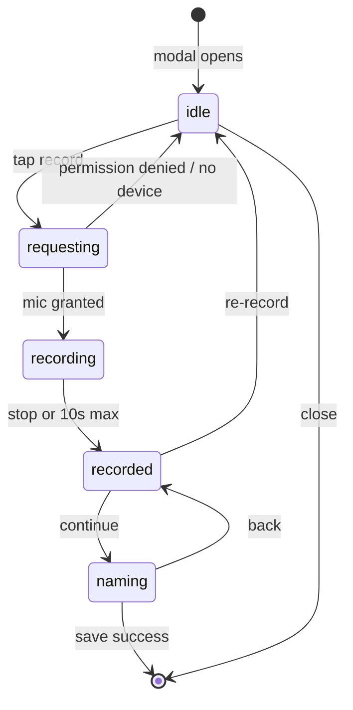

# Voice Recording Modal

Shared modal for capturing a short voice clip, reviewing it, and uploading it as a custom voice. Used on the voices page and project voice page.

**Dismiss policy and route map:** [MODALS.md](./MODALS.md#voicerecordingmodal)

**Source:** `src/components/shared/voice-recording-modal/`

**Import:**

```tsx
import { VoiceRecordingModal } from "@/components/shared/voice-recording-modal";
```

## Recording limit

Maximum clip length is **10 seconds** (`MAX_DURATION_S` in `constants.ts`). Recording auto-stops when the limit is reached. The UI shows a progress bar and an optional “max reached” notice on the review screen.

## Five-state flow

The modal is a linear wizard with one recording session per open. Each state maps to a distinct user moment and async boundary in the browser MediaRecorder API.



Errors appear in a banner above the active state; recording failures return to `idle`.

### 1. `idle` — Ready to record

**Component:** `components/idle-recording-view.tsx`

**UI:** Mic icon, short instructions, red circular record button, max-duration hint (0:10).

**Purpose:** Entry point before any mic permission is requested. The user opts in explicitly so the browser permission dialog does not fire as soon as the modal opens.

### 2. `requesting` — Waiting for browser permission

**Component:** `components/requesting-access-view.tsx`

**UI:** Spinner + mic icon, “Requesting access…” text. No interactive controls.

**Purpose:** `getUserMedia()` is async (user reads the OS/browser dialog). This state prevents the UI from looking frozen and blocks double-taps on record. On failure (denied, no device, in use), state returns to `idle` with an error banner.

### 3. `recording` — Live capture

**Component:** `components/active-recording-view.tsx`

**UI:** Pulsing red mic, live timer, progress bar toward 10s, square stop button. Close (X) is **disabled**.

**Purpose:** Clear “capture in progress” affordance. Disabling close avoids losing an in-progress take and leaving a dangling `MediaStream`. Auto-stop at 10s keeps clips short for voice-cloning upload size and model constraints.

### 4. `recorded` — Review before committing

**Component:** `components/recorded-playback-view.tsx`

**UI:** Green checkmark, duration summary, play/pause + seek bar, **Re-record** and **Continue**. Auto-plays ~300ms after stop (`AUTO_PLAY_DELAY_MS`).

**Purpose:** Quality gate before upload. Voice cloning is sensitive to bad takes; a dedicated review step lets the user listen before naming. Review (audio) and naming (metadata) are separate so playback and form fields do not compete on one screen.

- **Re-record** → `idle` (full reset)
- **Continue** → `naming`

### 5. `naming` — Metadata and upload

**Component:** `components/voice-naming-form.tsx`

**UI:** Name input, random-name generator, language selector, Back / Save Voice. Save shows a spinner during upload.

**Purpose:** Backend requires **name** and **language** only after the user confirms the audio. Random names (`dolphin-amber-42`) reduce friction. Back returns to `recorded` without losing the blob. Save runs WebM conversion (if needed), calls `uploadVoice()`, then closes the modal.

## Why five states?

| Fewer states | Problem |
| --- | --- |
| Three (idle / recording / done) | No loading during permission; review + naming combined |
| Single scrolling form | User names before hearing; harder to test and reason about |
| Separate modals | Blob handoff friction; more navigation |

Each state aligns with an async boundary:

```
idle        → user intent
requesting  → getUserMedia() pending
recording   → MediaRecorder active
recorded    → blob exists, playback possible
naming      → API upload pending
```

## Module layout

| File | Responsibility |
| --- | --- |
| `index.tsx` | Modal shell; wires phase → view components |
| `constants.ts` | `MAX_DURATION_S`, languages, mime types, timers |
| `types.ts` | `RecorderState`, props |
| `utils.ts` | Pure helpers (time format, mime detection, mic access, error mapping) |
| `hooks/use-voice-recording-modal.ts` | Single hook: phase machine, MediaRecorder, playback, save |
| `components/*-view.tsx` | Presentational UI per phase |

All recording, playback, and upload logic lives in one hook. Completed recordings are stored as React state (`recording`) instead of refs. Resource cleanup (streams, blob URLs, timers, audio) goes through one `cleanup()` function.

## Cross-cutting behavior

**Error banner** (`components/recording-error-banner.tsx`) — Shown for permission, device, playback, and save errors without extra states.

**Modal reset** — Opening resets to `idle`. Closing revokes blob URLs, stops streams, and stops playback. Safe to mount once and reopen repeatedly.

**Close button** — Disabled during `recording` and while `isSaving`. Allowed otherwise.

## Tests

Pure utils: `src/components/shared/voice-recording-modal/utils.test.ts` (Vitest).
