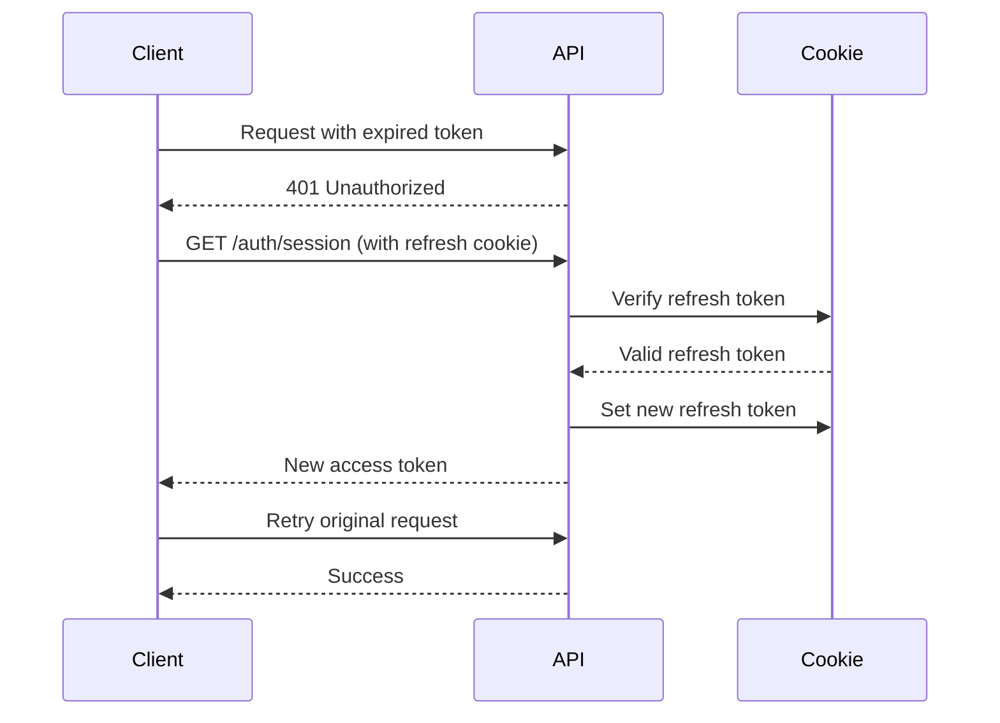

# Token Management and Session Handling

## Status

✅ **Fully Implemented** - All token management features are active and working.

## Overview

The application uses JWT-based authentication with automatic token refresh to provide seamless user experience during long workflow sessions.

## Architecture

### Backend (FastAPI)

- **Access Token**: JWT with 30-minute expiration (configurable via `ACCESS_TOKEN_EXPIRE_MINUTES`)
- **Refresh Token**: Secure HTTP-only cookie with 7-day expiration
- **Token Rotation**: Refresh tokens are rotated on each use for enhanced security
- **Cookie Settings**: `httponly=true`, `secure=true` (production), `samesite=none` (production) / `lax` (local)

### Frontend (Next.js)

The `api-client.ts` module implements a multi-layered approach to token management:

1. **Proactive Token Refresh** (NEW)
   - Parses JWT expiration from token payload
   - Schedules automatic refresh 2 minutes before expiration
   - Prevents 401 errors during idle sessions

2. **Reactive Token Refresh** (Improved)
   - Detects 401 Unauthorized responses
   - Attempts session refresh via `/auth/session` endpoint
   - Retries original request with new token
   - Clear error messaging on failure

3. **Token Storage**
   - Access token stored in memory (not localStorage for security)
   - Refresh token stored as HTTP-only cookie (server-managed)

## How It Works

### Initial Login

```typescript
// User logs in with Firebase or password
const { access_token } = await loginWithFirebase(idToken);
// or
const { access_token } = await loginWithPassword(email, password);

// Token is automatically set and refresh is scheduled
setAccessToken(access_token);
```

### Proactive Refresh (Automatic)

```typescript
// When token is set:
1. Parse JWT expiration: tokenExpiresAt = parseJwtExpiration(token)
2. Calculate refresh time: refreshIn = tokenExpiresAt - now - 2 minutes
3. Schedule refresh: setTimeout(() => refreshSession(), refreshIn)

// Before token expires:
- Timer triggers refreshSession()
- New token fetched from /auth/session
- New refresh scheduled automatically
```

### Reactive Refresh (On 401)

```typescript
// When API call returns 401:
1. Detect 401 response in request() function
2. Call refreshSession() to get new token
3. If successful: retry original request
4. If failed: clear session and throw error
```

### Session Refresh Flow



## Configuration

### Backend (.env)

```env
# Token expiration times
ACCESS_TOKEN_EXPIRE_MINUTES=30  # Access token lifetime
REFRESH_TOKEN_EXPIRE_DAYS=7     # Refresh token lifetime

# JWT settings
SECRET_KEY=your-secret-key-here
ALGORITHM=HS256
```

### Frontend (environment)

```env
NEXT_PUBLIC_API_URL=http://localhost:8020/api/v1
```

## Best Practices

### For Users

- **No manual refresh needed**: The system automatically refreshes tokens in the background
- **Long sessions supported**: You can work on projects for hours without interruption
- **Graceful expiration**: If refresh fails, you'll see a clear "Session expired" message

### For Developers

1. **Don't store tokens in localStorage**: Vulnerable to XSS attacks
2. **Use HTTP-only cookies for refresh tokens**: Protected from JavaScript access
3. **Keep access tokens short-lived**: 30 minutes is a good balance
4. **Rotate refresh tokens**: Issue new refresh token on each use
5. **Clear tokens on logout**: Revoke all refresh tokens server-side

## Troubleshooting

### Issue: Still seeing 401 errors

**Symptoms**: Random 401 errors even after implementing proactive refresh

**Solutions**:
1. Check backend logs for token verification errors
2. Verify `CORS_ORIGINS` includes your frontend URL
3. Ensure `credentials: "include"` is set on all fetch requests
4. Check browser console for any JWT parsing errors

### Issue: Session expires too quickly

**Symptoms**: User needs to log in frequently

**Solutions**:
1. Increase `ACCESS_TOKEN_EXPIRE_MINUTES` (max 60 recommended)
2. Increase `REFRESH_TOKEN_EXPIRE_DAYS` if needed
3. Verify proactive refresh is working (check for timer in dev tools)

### Issue: Refresh token not being sent

**Symptoms**: `/auth/session` returns 401

**Solutions**:
1. Check cookie settings match environment (localhost vs production)
2. Verify `SameSite` and `Secure` flags are appropriate
3. Check `path=/api/v1` matches your API base path
4. Ensure `credentials: "include"` is set

### Issue: Token refresh loop

**Symptoms**: Constant refresh requests

**Solutions**:
1. Verify JWT expiration parsing is working correctly
2. Check that `scheduleTokenRefresh()` clears previous timers
3. Ensure backend returns valid JWT with `exp` claim

## API Endpoints

### POST /auth/firebase-login
- **Purpose**: Login with Firebase ID token
- **Returns**: Access token + sets refresh cookie
- **Body**: `{ "id_token": "..." }`

### POST /auth/register
- **Purpose**: Register with email/password
- **Returns**: Access token + sets refresh cookie
- **Body**: `{ "email": "...", "password": "...", "name": "..." }`

### GET /auth/session
- **Purpose**: Get new access token using refresh cookie
- **Returns**: New access token + rotates refresh cookie
- **Headers**: Cookie with `studio_refresh_token`

### POST /auth/refresh
- **Purpose**: Explicit token refresh (alternative to /session)
- **Returns**: New access token + rotates refresh cookie
- **Headers**: Cookie with `studio_refresh_token`

### POST /auth/logout
- **Purpose**: End session and revoke all refresh tokens
- **Returns**: Success message + clears refresh cookie

## Security Considerations

1. **XSS Protection**: Access tokens in memory only (not localStorage)
2. **CSRF Protection**: HTTP-only refresh cookies + SameSite policy
3. **Token Rotation**: Refresh tokens invalidated after use
4. **Secure Transport**: HTTPS required in production
5. **Token Revocation**: All refresh tokens revoked on logout

## Testing

### Verify Implementation

Before testing, confirm that:

```bash
# Backend: Token expiration is 30 minutes
cd studio-backend
grep "ACCESS_TOKEN_EXPIRE_MINUTES" app/config.py
# Should show: ACCESS_TOKEN_EXPIRE_MINUTES: int = 30

# Frontend: Proactive refresh is implemented
cd studio-web
grep -A 5 "scheduleTokenRefresh" src/lib/api-client.ts
# Should show the scheduling logic
```

### Manual Testing

1. **Start both services**:
   ```bash
   # Terminal 1: Backend
   cd studio-backend && uv run uvicorn app.main:app --reload
   
   # Terminal 2: Frontend
   cd studio-web && npm run dev
   ```

2. **Login and verify refresh**:
   - Open browser DevTools → Console
   - Log in to the application
   - You should see no console errors related to tokens
   - Work through project workflows for 30+ minutes
   - No 401 errors should appear

3. **Quick test with modified expiration** (optional):
   - Temporarily set `ACCESS_TOKEN_EXPIRE_MINUTES: int = 3` in `studio-backend/app/config.py`
   - Restart backend
   - Login and observe automatic refresh every 1 minute
   - Remember to revert to 30 minutes

### Automated Testing

See `tests/test_auth.py` for comprehensive auth flow tests:

```bash
cd studio-backend
uv run pytest tests/test_auth.py -v
```

## Migration Notes

### Upgrading from Previous Version

1. **Frontend changes**: Token refresh is now automatic - no code changes needed in components
2. **Backend changes**: Access token expiration increased from 15 to 30 minutes
3. **No breaking changes**: Existing sessions will continue to work

### Deployment

1. Update backend environment variables if needed
2. Deploy backend first (backward compatible)
3. Deploy frontend (will use new proactive refresh)
4. No database migrations required

## References

- [JWT Best Practices](https://tools.ietf.org/html/rfc8725)
- [OWASP Token Storage](https://cheatsheetseries.owasp.org/cheatsheets/JSON_Web_Token_for_Java_Cheat_Sheet.html)
- [MDN: HTTP Cookies](https://developer.mozilla.org/en-US/docs/Web/HTTP/Cookies)
